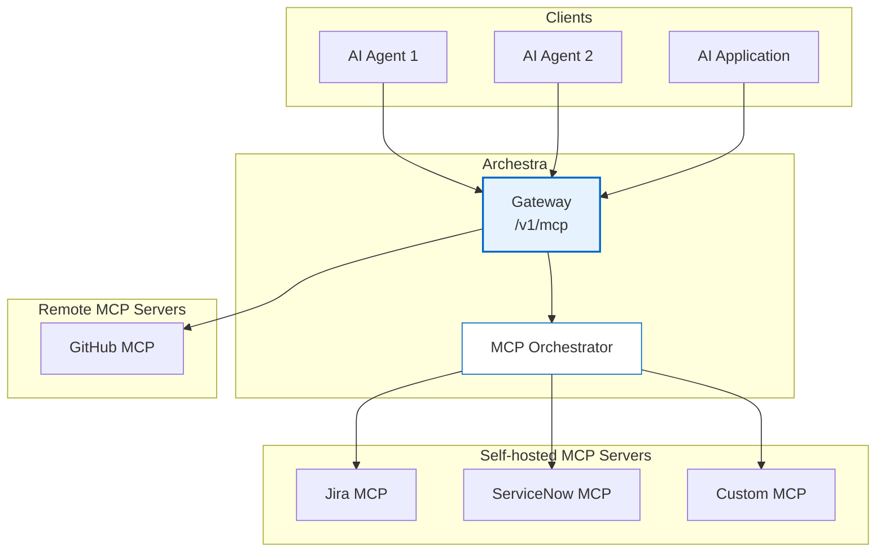

<!-- 
Check ../docs_writer_prompt.md before changing this file.

This document is human-built, shouldn't be updated with AI. Don't change anything here.

Exception:
- Screenshot
-->

MCP Gateway is the unified access point for all MCP servers in Archestra Platform. It provides a single endpoint through which AI agents and applications can discover and interact with multiple MCP servers, regardless of whether they are remote services or locally orchestrated containers.

## To use MCP Gateway:

1. Go to "MCP Registry" and install MCP server.
2. Go to "Profiles" -> Wrench Icon -> Assign tools to the profile.
3. Go to "Profiles" -> Connect Icon -> You'll get connection instructions.



## Authentication

Archestra's MCP Gateways support two authentication methods:

### OAuth 2.1 (Recommended for MCP Clients)

The gateway implements the [MCP Authorization specification](https://modelcontextprotocol.io/specification/2025-03-26/basic/authorization) with OAuth 2.1. MCP clients that support OAuth can authenticate automatically — the client discovers endpoints via standard metadata URLs, performs an authorization code flow with PKCE, and receives an access token.

```
POST /v1/mcp/<profile_id>
Authorization: Bearer <access_token>
```

**Discovery endpoints:**

| Endpoint | Purpose |
|---|---|
| `GET /.well-known/oauth-protected-resource/v1/mcp/<profile_id>` | Resource metadata (RFC 9728) |
| `GET /.well-known/oauth-authorization-server` | Authorization server metadata (RFC 8414) |

### Bearer Token

For direct API integrations, use Archestra-issued tokens in the `Authorization` header. Tokens can be scoped to an individual user, a team, or the entire organization — controlling which MCP Gateways and credentials are accessible.

```
POST /v1/mcp/<profile_id>
Authorization: Bearer archestra_<token>
```

Create tokens in **Settings → Tokens** or via the Archestra API.
